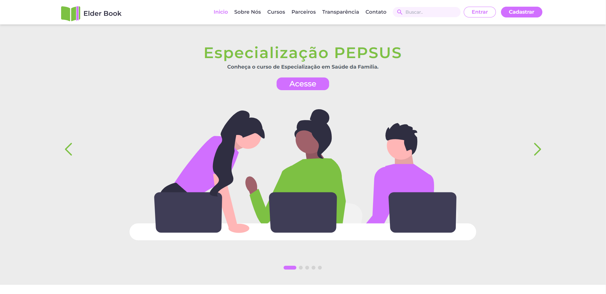

<h1 align="center">
   
</h1>

<div align="center">
  <a rel="noopener" href="#-Projeto">Projeto</a>&nbsp;&nbsp;&nbsp;|&nbsp;&nbsp;&nbsp;
  <a rel="noopener" href="#-Acesse">Acesse</a>&nbsp;&nbsp;&nbsp;|&nbsp;&nbsp;&nbsp;
  <a rel="noopener" href="#-Execute em sua máquina">Execute</a>&nbsp;&nbsp;&nbsp;
</div>

<br>

<p align="center">
  <p align="center">
  
</p>

</p>

## 💻 Projeto

O Ambiente Virtual de Aprendizagem do SUS, AVASUS, é uma plataforma que vem
auxiliando na transformação do cotidiano da saúde pública brasileira por meio da
formação continuada em trabalho. Acesse [aqui](https://avasus.ufrn.br/).

No AVASUS há uma Comunidade de Práticas que permite a troca de experiências e
interação entre alunos de cursos à distância para otimizar o seu aprendizado. Ela designa
um grupo de pessoas que se unem em torno de um mesmo tópico ou interesse. Essas
pessoas trabalham juntas para achar meios de melhorar o que fazem, ou seja, na
resolução de um problema na comunidade ou no aprendizado diário, através da interação
regular.

Na perspectiva do aluno, a comunidade de práticas propicia ampliar a perspectiva sobre
um determinado tema. É esperado que ele possa interagir da seguinte forma:

- comentar as postagens dos outros integrantes da comunidade;
- compartilhar para fora da comunidade (e-mail, whatsapp, instagram, etc);
- ranquear avaliar a postagem;
- salvar (PDF).

Não obstante, o projeto consiste na implementação do front-end de uma plataforma para
visualização de módulos **educacionais**, **parceiros** e **indicadores de transparência pública**.
A proposta deverá seguir o design system disposto no protótipo de média fidelidade
disponibilizado no seguinte [endereço](https://bit.ly/laisedital212022front).

### 📁 Features

- [x] Proposta criada fielmente ao protótipo de média fidelidade presente no seguinte [endereço](https://bit.ly/laisedital212022front);
- [x] Página inicial:
  - [x] Página inicial com menu de navegação, seção de destaques, seção de listagem de módulos educacionais, seção de parcerias e rodapé com links;
  - [x] Na seção de listagem de módulos educacionais, são mostrados 3 módulos por aba. Os módulos mostrados são recuperados da API presente no seguinte [repositório](https://github.com/lais-huol/edital-21-22-modulos-educacionais) hospedado no seguinte [link](https://lais-api.herokuapp.com).
  - [x] A barra de navegação superior permanece fixa no topo ao rolar a página.
- [x] Página de listagem módulos educacionais:
  - [x] Separar os módulos educacionais por categoria;
  - [x] Ordenar e filtrar os módulos educacionais em suas categorias;
  - [x] A listagem deve ser paginada.
  - [x] Exibir total de módulos e a quantidade de módulos mostrados no momento.
- [x] Página de informação sobre o módulo educacional:
  - [x] Exibir um cabeçalho com o nome, parceiros e imagem de capa do módulo educacional;
  - [x] Exibir seções de informações gerais, sobre o curso, objetivos, recursos educacionais e créditos.
- [x] Página de listagem dos parceiros:
  - [x] A listagem deve ser paginada.
  - [x] Exibir total de parceiros e a quantidade de parceiros mostrados no momento.
- [x] Página de transparência
  - [x] Exibição de dados gerais;
  - [x] Mapa interativo com usuários por estado.

📌 **Extra**: 
 - [x] Responsividade;
 - [x] tela de login;
 - [x] Tela de cadastro;
 - [x] Tela de página não encontrada;
 - [x] Animações de carregamento;
 - [x] Sistema de genérica por termo;
 - [x] Deploy no netlify em [https://elderbook.netlify.app/](https://elderbook.netlify.app/).

## 💻 Acesse
<a target="_blank" rel="noopener" href="https://elderbook.netlify.app/">Clique aqui</a> para acessar a aplicação. <br/>
<a target="_blank" rel="noopener" href="https://lais-api.herokuapp.com">Clique aqui</a> para acessar a API.

## 💡 Execute em sua máquina

- Clone este repositorio:

```bash
$ git clone https://github.com/ErnaneJ/lais-2122.git
```

- Instale todas as dependências:

```bash
$ npm install # ou yarn
```
- Inicie a aplicação:

```bash
$ npm start
```

---

<div align="center">
  Desenvolvido com ❤ por <a target="_blank" rel="noopener" href="https://www.ernane.dev/">Ernane Ferreira</a>. 👋🏻
</div>
